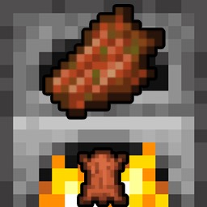

# Flesh2Leather



**Cook 1 Rotten Flesh into 1 Leather** — a tiny vanilla Minecraft Java datapack by [myzticdev](https://mc.myztic.dev/).

Furnace: 10 seconds · Smoker (Java 1.14+): 5 seconds · 0.35 XP  
No resource pack. No functions. No tick loop. Nothing else changes.

**Downloads & install notes:** [mc.myztic.dev/projects/flesh2leather](https://mc.myztic.dev/projects/flesh2leather/)

---

## Install

1. Open the [project page](https://mc.myztic.dev/projects/flesh2leather/) and download the ZIP for your Minecraft Java version  
   (or grab a file from [GitHub Releases](https://github.com/myzticdev/flesh2leather/releases)).
2. Put that ZIP in your world’s `datapacks/` folder. **Install only one variant.**
3. Reopen the world, or run `/reload` if you have permission.
4. Confirm with `/datapack list enabled`, then cook rotten flesh with fuel.

If you download the **All-Versions** bundle, extract it first and use **one** of the inner ZIPs — do not drop the master bundle into `datapacks/`.

Something broken? [Open an issue](https://github.com/myzticdev/flesh2leather/issues) and include your Minecraft version.

---

## Compatibility

| Minecraft Java | Download |
| --- | --- |
| 1.20.2 – 26.3 | `Flesh2Leather-1.20.2-26.3.zip` |
| 1.20 – 1.20.1 | `Flesh2Leather-1.20-1.20.1.zip` |
| 1.19.4 | `Flesh2Leather-1.19.4.zip` |
| 1.19 – 1.19.3 | `Flesh2Leather-1.19-1.19.3.zip` |
| 1.18.2 | `Flesh2Leather-1.18.2.zip` |
| 1.18 – 1.18.1 | `Flesh2Leather-1.18-1.18.1.zip` |
| 1.17 – 1.17.1 | `Flesh2Leather-1.17.x.zip` |
| 1.16.2 – 1.16.5 | `Flesh2Leather-1.16.2-1.16.5.zip` |
| 1.15 – 1.16.1 | `Flesh2Leather-1.15-1.16.1.zip` |
| 1.14 – 1.14.4 | `Flesh2Leather-1.14.x.zip` |
| 1.13 – 1.13.2 | `Flesh2Leather-1.13.x.zip` (furnace only) |

26.3 is the official version name (no `1.` prefix). Snapshots are not promised.  
Prefer the [site download table](https://mc.myztic.dev/projects/flesh2leather/#downloads) if you just want the right file quickly.

Pack format notes and validation details for maintainers are below.

---

## Links

- **Website:** [mc.myztic.dev](https://mc.myztic.dev/) · [Flesh2Leather](https://mc.myztic.dev/projects/flesh2leather/)
- **Releases:** [github.com/myzticdev/flesh2leather/releases](https://github.com/myzticdev/flesh2leather/releases)
- **Issues:** [github.com/myzticdev/flesh2leather/issues](https://github.com/myzticdev/flesh2leather/issues)
- **Org:** [github.com/myzticdev](https://github.com/myzticdev)

---

## For pack maintainers

### Compatibility detail

| Download suffix | Java versions | Data pack format |
| --- | --- | --- |
| `1.13.x` | 1.13–1.13.2 (furnace only) | 4 |
| `1.14.x` | 1.14–1.14.4 | 4 |
| `1.15-1.16.1` | 1.15–1.16.1 | 5 |
| `1.16.2-1.16.5` | 1.16.2–1.16.5 | 6 |
| `1.17.x` | 1.17–1.17.1 | 7 |
| `1.18-1.18.1` | 1.18–1.18.1 | 8 |
| `1.18.2` | 1.18.2 | 9 |
| `1.19-1.19.3` | 1.19–1.19.3 | 10 |
| `1.19.4` | 1.19.4 | 12 |
| `1.20-1.20.1` | 1.20–1.20.1 | 15 |
| `1.20.2-26.3` | 1.20.2–26.3 | 18–121.0 |

Validation checks JSON, metadata, recipe schemas, effective overlay selection, and archive structure. Manual furnace and smoker checks have been reported successful on representative releases through 26.3, including the modern overlay transitions. This is not an exhaustive test of every supported patch or modded environment; automated validation does not run Minecraft gameplay tests.

### Build

Requires Python 3.11 or newer; no third-party packages. From the repository root:

```sh
python scripts/build.py
```

On Windows installations using the Python launcher, use `py scripts/build.py`.
The command validates all source JSON and pack metadata, recipe contents, overlay
ranges, and ZIP roots. It safely recreates `dist/` and writes archives in sorted
order with fixed timestamps and permissions. Each ZIP is checked for integrity
and exact contents. Validation errors exit nonzero. ZIPs use uncompressed entries
for identical output across platforms and compression-library versions.

Editable packs and `targets.json` live in `src/`; tooling lives in `scripts/`.
The shared project icon is `src/pack.png`. Every datapack ZIP includes it at
the archive root as `pack.png`; use this same image for project listings.
`dist/` is ignored by Git and contains only these reproducible outputs:

- Eleven `Flesh2Leather-<range>.zip` files matching the table above.
- `SHA256SUMS.txt`, covering the eleven individual ZIPs.
- `Flesh2Leather-myzticdev-All-Versions.zip`, containing those ZIPs and checksums.

Never edit `dist/` files. Edit source and rebuild.

Run recipe-validation regression checks with
`python -m unittest discover -s scripts -p "test_*.py"`. Both workflows run these
checks before building. Minecraft 1.13 requires the plain `smelting` serializer;
1.14 uses `minecraft:smelting` despite sharing pack format 4.

### Maintaining compatibility

Before adding a release, check its official technical changelog and test the pack
in that version: enable/reload without recipe errors, then verify one leather per
rotten flesh, furnace/smoker timing, and no unrelated recipes.

For a legacy split, copy the closest pack under `src/`, update its `pack.mcmeta`
and `README.txt`, and add the version range and format to `src/targets.json`.
Split on format or recipe incompatibility; 1.13 and 1.14 are separate because
smokers were introduced in 1.14 despite both using format 4.

For the modern pack, update its metadata, target name, source directory, and the
explicit format boundaries in `scripts/build.py` together. Add an overlay when
recipe syntax, directory layout, or cooking behavior changes. Keep both old and
new metadata representations consistent and cap the range at the checked release.
Current overlays cover result stacks (41), singular recipe paths (48), simplified
ingredients (57), and revised smoker timing (121). The old `supported_formats`
range ends at 81; `min_format`/`max_format` cover 18.0–121.0. Update this table and
the changelog after checking boundaries. Do not extend the range speculatively.

Technical references: [multi-version packs](https://www.minecraft.net/en-us/article/minecraft-java-edition-1-20-2),
[result stacks](https://www.minecraft.net/en-us/article/minecraft-java-edition-1-20-5),
[directory names](https://www.minecraft.net/en-us/article/minecraft-java-edition-1-21),
[ingredients](https://www.minecraft.net/en-us/article/minecraft-java-edition-1-21-2),
[pack metadata](https://www.minecraft.net/en-us/article/minecraft-java-edition-1-21-9),
[26.3 cooking recipes](https://www.minecraft.net/en-us/article/minecraft-java-edition-26-3).

### Release

Pushes and pull requests run `.github/workflows/ci.yml` and retain build artifacts.
After validation and in-game checks, add a dated `CHANGELOG.md` entry, commit the
source, and push a `vMAJOR.MINOR.PATCH` tag (for example `v1.0.0`).
`.github/workflows/release.yml` runs the same build, requires a matching changelog
entry, and publishes all thirteen files with that entry as release notes.
